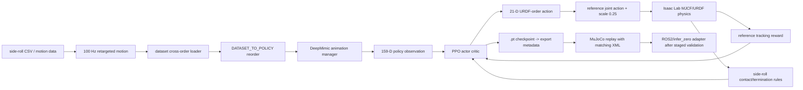
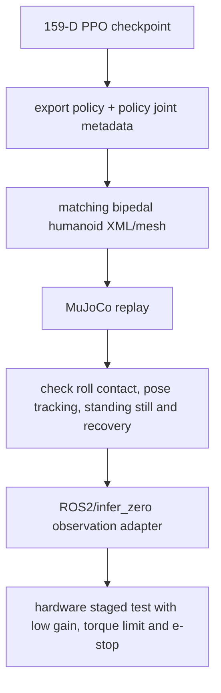
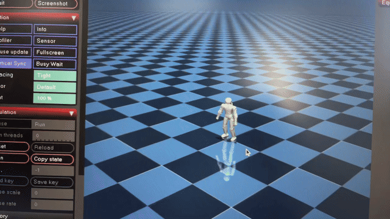

<p align='center'><a href='#zh'>中文</a> | <a href='#en'>English</a></p>
<a id='zh'></a>

# 翻滚训练架构（159-D DeepMimic）

## 1. 项目定位

本项目是双足人形机器人的侧滚—起立一体参考动作模仿任务。它使用 100 Hz 侧滚动作和 159-D URDF-order DeepMimic policy，滚地时允许躯干横躺和身体接触，末段仍通过参考动作偏差和静止段约束把策略带回站立状态。

本项目只使用 DeepMimic reference tracking + PPO，不使用 AMP discriminator，也不使用 DWAQ/β-VAE。159-D checkpoint 不能加载 161-D 全身舞蹈 checkpoint；动作数据集顺序和 policy 顺序也不是同一顺序。

| 项目项 | 当前配置 |
|---|---|
| Train task | `LeggedLab-Isaac--Deepmimic-Lens110-SideRoll-v0` |
| Play task | `LeggedLab-Isaac--Deepmimic-Lens110-SideRoll-Play-v0` |
| motion | `side_roll_R_002__A415_M_100hz_lens110` |
| policy observation | `159` |
| action | `21`，URDF/policy 顺序 |
| physics / policy | `500 Hz / 100 Hz` |
| action scale | `0.25`，`preserve_order=True` |
| 随机初始化 | 训练 `random_initialize=True`；PLAY 固定起始帧 |
| 导出包 | `exports/versions/Lens110_SideRoll_Sim2Real_v1_20260910_policy27500` |

## 2. 原理

侧滚策略每个时刻接收当前本体状态和未来 4 帧参考 root/关节姿态，直接输出 21 维参考关节目标残差/目标动作。DeepMimic 的指数跟踪项使 pelvis、关键刚体、关节位置和速度跟随侧滚参考；PPO 在接触、摩擦、质量扰动和终止条件下学习一个可执行策略。

159-D 的主要差异是：

- 根角速度使用 body-frame `root_ang_vel_b`，便于侧滚过程中保持局部姿态语义。
- 去掉 161-D 版本的 `foot_contact` 2 维输入。
- 参考动作的 dataset 交叉顺序通过 `DATASET_TO_POLICY` 重排为 `POLICY_JOINT_NAMES`。
- action 使用 `ReferenceJointPositionActionCfg`、`scale=0.25`、`use_default_offset=False`、`preserve_order=True`。

## 3. 总体流程图



## 4. 训练框架构成

| 层 | 实现 | 作用 |
|---|---|---|
| Motion data | `data/motions/side_roll_retargeted`、100 Hz CSV/NPY/PKL | 侧滚和起立参考序列 |
| Animation manager | DeepMimic animation/reference loader | 提供当前/未来参考帧和 RSI 起始状态 |
| Observation manager | root rotation、body-frame angular velocity、关节状态、未来参考帧 | 形成 159-D policy input |
| Action manager | `ReferenceJointPositionActionCfg` | 按 URDF policy order 应用 21 维动作 |
| Reward manager | DeepMimic tracking + torque/acc/action-rate | 跟踪动作并控制能耗/平滑 |
| Termination manager | 侧滚专用合法接触和偏差门 | 允许滚地，不允许躺平漂移 |
| PPO runner | RSL-RL actor-critic rollout/update | 学习参考动作下的可执行控制 |
| Replay/export | policy、XML、mesh、metadata、replay script | 固化 sim2sim 接口 |

关键配置为 `lens110_deepmimic_env_cfg_159.py` 和 `lens110_deepmimic_env_cfg_sideroll.py`。侧滚只改任务边界和数据，不改变 159-D 的 observation/action 维度。

## 5. Observation 函数和维度

| Observation term | 维度 | 含义 |
|---|---:|---|
| `root_rot_tan_norm` | 6 | 根部旋转的连续 6D 表示 |
| `root_ang_vel_b` | 3 | body-frame 根部角速度 |
| `joint_pos` | 21 | `POLICY_JOINT_NAMES` 顺序的当前关节位置 |
| `joint_vel` | 21 | 同一 policy 顺序的当前关节速度 |
| `ref_root_rot_tan_norm` | 24 | 未来 4 帧参考 root rotation，每帧 6 维 |
| `ref_joint_pos` | 84 | 未来 4 帧参考关节位置，每帧 21 维，已重排到 policy 顺序 |
| **总计** | **159** | `6+3+21+21+4*6+4*21` |

训练只对本体可测项注入配置中的噪声：root rotation `[-0.01,0.01]`、root angular velocity `[-0.1,0.1]`、joint position `[-0.01,0.01]`、joint velocity `[-0.2,0.2]`；reference 项不加噪声。159-D policy 没有 foot-contact 观测，不能把 161-D 的 contact 2 维补回去。

### 顺序边界

`DATASET_JOINT_NAMES` 是动作文件的 USD 交叉顺序，`POLICY_JOINT_NAMES` 是 policy/URDF 顺序；配置中的 `DATASET_TO_POLICY` 是唯一重排依据。GMR/deployment CSV 根四元数使用 `xyzw`，MuJoCo qpos 使用 `wxyz`。

## 6. Action

```text
action_dim = 21
action order = POLICY_JOINT_NAMES
scale = 0.25
use_default_offset = False
preserve_order = True
```

这套动作是 159-D 任务专用的 ReferenceJointPositionAction。要导出或回放，policy、animation 数据、XML/URDF、动作 scale 和 joint order 必须成套，不能拿 161-D H 版 `q_ref + residual` 运行本任务。

## 7. Reward 函数由什么构成

侧滚沿用 DeepMimic 的参考跟踪和正则奖励，侧滚配置在此基础上调整存活、接触、摩擦和静止段项。

| 类别 | Reward term | 权重 | 作用 |
|---|---|---:|---|
| root 跟踪 | root position error exponential | `+0.15` | 跟踪根部位移/滚动行程 |
| root 跟踪 | quaternion error exponential | `+0.15` | 跟踪根部姿态 |
| root 跟踪 | root linear velocity error exponential | `+0.10` | 跟踪滚动线速度 |
| root 跟踪 | root angular velocity error exponential | `+0.05` | 跟踪滚动角速度 |
| 形态跟踪 | key-body position error exponential | `+0.30` | 保持躯干、髋、膝、肩等关键点相对形态 |
| 关节跟踪 | DOF position error exponential | `+0.80` | 21 个关节参考角度 |
| 关节跟踪 | DOF velocity error exponential | `+0.10` | 参考动作动态节奏 |
| 动力学 | torque L2 | `-1e-6` | 抑制过大力矩 |
| 动力学 | joint acceleration L2 | `-2.5e-8` | 抑制高频冲击 |
| 平滑 | scaled action-rate L2 | `-0.001` | 在 0.25 目标空间里惩罚动作跳变 |
| 生存 | `alive` | `+0.05` | 侧滚配置降低躺平状态的存活保底 |
| 防蹭步 | `standing_still` | `-2.0` | 参考 root 速度低于 `0.1 m/s` 时惩罚机器人根部速度 |

终止不是普通奖励项。侧滚显式关闭 `base_contact` 和 `bad_orientation`，因为滚地中的躯干接触/横躺是合法状态；`base_height` 下限降到 `0.02 m`。同时保留 root 和 key-body 相对参考偏差终止，阈值收紧到 `0.8 m`，这样“躺平不动”不会成为合法最优。

训练随机化 static/dynamic friction 为 `0.5..1.5`，骨盆质量扰动为 `±0.5 kg`，用于覆盖 sim2sim 的滑动和负载差异。这里没有 AMP style reward，也没有 VAE loss；优化目标就是 DeepMimic task reward 加 PPO loss。

## 8. 训练、导出和回放

```text
data/motions/side_roll_retargeted/    # 侧滚数据和质量检查结果
data/training/deepmimic_motion/      # loader 直接读取的参考动作
experiments/deepmimic_runs/          # checkpoint/TensorBoard
exports/versions/                    # sim2real/replay 包
docs/REWARD_STRUCTURE.md             # 奖励证据
docs/                              # 奖励证据和复现记录
```

训练入口：

```bash
./projects/05_side_roll/scripts/train.sh --headless --num_envs 4096 --max_iterations 30000
```

训练使用 RSI，从参考动作随机帧初始化；PLAY 关闭随机初始化以便复现固定回放。验收时同时检查 159-D/21-D、数据到 policy 的重排、侧滚接触、0.8 m 偏差终止、摩擦/质量随机化和动作末段起立。

## 9. 导出、MuJoCo 和真机



硬件部署前必须把 policy 的 URDF 顺序与 SDK 顺序分开记录，明确四元数转换和动作 scale。MuJoCo 回放通过只说明模型能在仿真中执行，不等于横滚冲击、摩擦和起立动作已经通过真机安全验证。

## 10. 复现验收清单

- [ ] 使用 159-D 任务配置和对应 159-D checkpoint。
- [ ] 观测为 `6+3+21+21+24+84=159`，没有 foot-contact 2 维。
- [ ] `DATASET_TO_POLICY` 和 `preserve_order=True` 生效。
- [ ] action 为 21、scale 为 0.25，不能使用 H 版 161-D 语义。
- [ ] 侧滚阶段允许躯干接触/横躺，躺平漂移仍被偏差终止捕获。
- [ ] 静止段参考速度阈值 `0.1 m/s` 与 `standing_still=-2.0` 一致。
- [ ] MuJoCo XML、mesh、四元数、频率、joint order 和动作包一致。
- [ ] 真机验证包含冲击、摩擦、温度、电流、急停和回退方案。

## 项目演示



GIF 是 README 直接展示的演示片段；原始 MP4 保留在 `docs/media/side-roll-to-stand-demo.mp4` 供下载和复核。

<a id='en'></a>

# Side-Roll Training Architecture (159-D DeepMimic)

## Scope

This repository trains the bipedal humanoid robot side-roll-to-stand reference-motion task. It uses 100 Hz motion data, a 159-dimensional URDF-order DeepMimic policy, and PPO. It does not use AMP, DWAQ, or beta-VAE. The roll phase allows torso contact and a horizontal posture, while reference deviation and a stillness cost prevent lying flat from becoming a valid final state.

The 159 dimensions are 6 root rotation, 3 body-frame root angular velocity, 21 joint positions, 21 joint velocities, 24 future root rotations, and 84 future joint positions. Foot contact is intentionally absent. Dataset joint order is converted through `DATASET_TO_POLICY` into `POLICY_JOINT_NAMES`; the action is 21-dimensional with `scale=0.25` and `preserve_order=True`.

## Reward

The environment uses DeepMimic exponential tracking: root position `+0.15`, root quaternion `+0.15`, root linear/angular velocity `+0.10/+0.05`, key-body position `+0.30`, DOF position/velocity `+0.80/+0.10`, torque `-1e-6`, acceleration `-2.5e-8`, and scaled action rate `-0.001`. Side-roll changes alive to `+0.05`, adds `standing_still=-2.0` when reference root speed is below `0.1 m/s`, widens friction to `0.5..1.5`, and randomizes pelvis mass by `±0.5 kg`.

Base-contact and bad-orientation terminations are disabled for the roll, minimum height is `0.02 m`, and root/key-body deviation thresholds are `0.8 m`. This combination permits the intended roll contact without allowing an unrecovered lying state.

## Reproduction and deployment

Run `./projects/05_side_roll/scripts/train.sh --headless --num_envs 4096 --max_iterations 30000` in the local Isaac Lab environment. Use random reference initialization for training and fixed initialization for PLAY. Keep motion order, policy order, quaternion convention, XML/mesh, action scale, replay evidence, and hardware safety limits together. MuJoCo qpos uses `wxyz`; GMR/deployment CSV uses `xyzw`.
